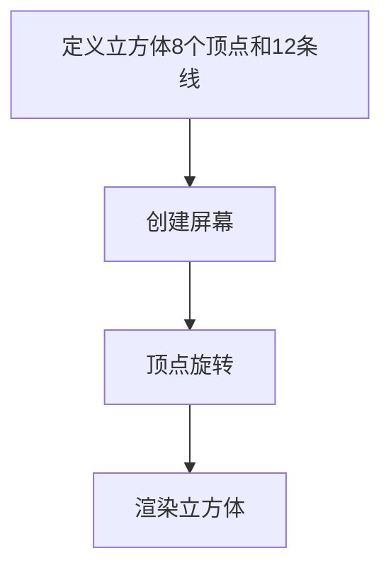

# 手动绘制一个立方体
## 任务
创建一个屏幕，渲染一个旋转的立方体

## 技术库
- numpy: 用于矩阵计算
- turtle: 用于绘制
- math: 计算三角函数
## 绘制步骤


## 代码步骤
一个一个来
### 定义立方体8个顶点和12条线
考虑到turtle的坐标系，如果希望立方体的中心在屏幕中央，则左右点坐标应该为相反数。
```python
import numpy as np
# 定义立方体的8个顶点坐标 (x, y, z)
vertices = np.array([
    [-100, -100, -100],  # 0: 左下后
    [ 100, -100, -100],  # 1: 右下后
    [ 100,  100, -100],  # 2: 右上后
    [-100,  100, -100],  # 3: 左上后
    [-100, -100,  100],  # 4: 左下前
    [ 100, -100,  100],  # 5: 右下前
    [ 100,  100,  100],  # 6: 右上前
    [-100,  100,  100]   # 7: 左上前
], dtype=float)

# 定义立方体的12条边（索引值）（每条边由两个顶点组成）
edges = [
    (0, 1), (1, 2), (2, 3), (3, 0),  # 后面的四条边
    (4, 5), (5, 6), (6, 7), (7, 4),  # 前面的四条边
    (0, 4), (1, 5), (2, 6), (3, 7)   # 连接前后面的四条边
]
```

### 创建屏幕
```python
import turtle
turtle.setup(800, 600)
turtle.bgcolor("black")
turtle.title("3D Cube with Turtle")
# 画笔设置
turtle.tracer(0)
turtle.pensize(2)
turtle.hideturtle()
```

## 顶点旋转
旋转顶点的本质是顶点矩阵乘以一个旋转矩阵，所以我们需要一个创建旋转矩阵的函数
```python
import math
def get_rotation_matrix(angle):
    """
    获取绕Y轴旋转的旋转矩阵
    """
    cos_angle = math.cos(math.radians(angle))
    sin_angle = math.sin(math.radians(angle))
    
    # 绕y轴旋转的矩阵
    rotation_matrix = np.array([
        [cos_angle, 0, sin_angle],
        [0, 1, 0],
        [-sin_angle, 0, cos_angle]
    ])
    
    return rotation_matrix
```
那么旋转就很简单了
```python
rotation_matrix = get_rotation_matrix(angle)
rotated_vertices = vertices @ rotation_matrix
```

## 渲染立方体
### 将三维坐标转换为二维坐标
按照近大远原则，顶点坐标随着z轴的远近而变小
```python
def project_to_2d(x, y, z):
    factor = 300 / (300 + z)
    screen_x = x * factor
    screen_y = y * factor
    return screen_x, screen_y
```
### 绘制立方体
```python
for edge in edges:
    # 抬笔，到顶点A
    turtle.penup()
    turtle.goto(*project_to_2d(*rotated_vertices[edge[0]]))
    # 落笔(开始画线)，到顶点B
    turtle.pendown()
    turtle.goto(*project_to_2d(*rotated_vertices[edge[1]]))
```

### 最后，更新屏幕
```python
turtle.update()
```

## 组合一下代码
[Turtle绘制立方体.py](../projects/Turtle绘制立方体.py)
```python
import time

import numpy as np
import turtle
import math
# 定义立方体的8个顶点坐标 (x, y, z)
vertices = np.array([
    [-100, -100, -100],  # 0: 左下后
    [ 100, -100, -100],  # 1: 右下后
    [ 100,  100, -100],  # 2: 右上后
    [-100,  100, -100],  # 3: 左上后
    [-100, -100,  100],  # 4: 左下前
    [ 100, -100,  100],  # 5: 右下前
    [ 100,  100,  100],  # 6: 右上前
    [-100,  100,  100]   # 7: 左上前
], dtype=float)

# 定义立方体的12条边（每条边由两个顶点组成）
edges = [
    (0, 1), (1, 2), (2, 3), (3, 0),  # 后面的四条边
    (4, 5), (5, 6), (6, 7), (7, 4),  # 前面的四条边
    (0, 4), (1, 5), (2, 6), (3, 7)   # 连接前后面的四条边
]

turtle.setup(800, 600)
# turtle.bgcolor("black")
turtle.title("3D Cube with Turtle")
turtle.tracer(0)
turtle.pensize(2)
turtle.hideturtle()


def get_rotation_matrix(angle):
    """
    获取绕Y轴旋转的旋转矩阵
    """
    cos_angle = math.cos(math.radians(angle))
    sin_angle = math.sin(math.radians(angle))

    # 绕y轴旋转的矩阵
    rotation_matrix = np.array([
        [cos_angle, 0, sin_angle],
        [0, 1, 0],
        [-sin_angle, 0, cos_angle]
    ])

    return rotation_matrix


def project_to_2d(x, y, z):
    factor = 300 / (300 + z)
    screen_x = x * factor
    screen_y = y * factor
    return screen_x, screen_y


angle = 0
while True:
    turtle.clear()  # 注释这行有奇效
    rotation_matrix = get_rotation_matrix(angle)
    rotated_vertices = vertices @ rotation_matrix

    for edge in edges:
        # 抬笔，到顶点A
        turtle.penup()
        turtle.goto(*project_to_2d(*rotated_vertices[edge[0]]))
        # 落笔(开始画线)，到顶点B
        turtle.pendown()
        turtle.goto(*project_to_2d(*rotated_vertices[edge[1]]))
    angle += 1
    turtle.update()
    time.sleep(0.01)
```