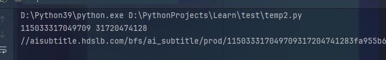

# 爬取哔哩哔哩字幕
仍然是建议使用第三方库直接爬取，这种大型网站有很多爬虫项目可以直接使用，而不是手写爬虫

下面是重头开始分析哔哩哔哩字幕获取流程

### 1. 找到字幕地址
打开视频页面，打开调试页面，点击字幕按钮，在调试页面总查看出现的请求，根据结果  
  

### 2. 分析网址来源
先刷新网页，直接搜索这个地址，记得掐头去尾，比如把`https://`和尾部的`**=**`给去掉  
搜索后发现它来自另一个请求  
  

这个请求的网址是`https://api.bilibili.com/x/player/wbi/v2?aid=115033317049709&cid=31720474128&isGaiaAvoided=false&web_l...`
既然这个网址包含字幕的网址，我们只需要分析这个网址的来源即可

### 3. 继续分析网址来源
尝试直接请求这个网址，发现成功，再删除后面的几个参数，最后发现只需要保留`aid`和`cid`参数就能请求成功  
那么接下来只要知道aid和cid哪来的就行

查看请求的发起程序  
    
可以看到一堆看不懂的栈，但点进去看看就差不多知道，core文件是他们家的请求库，跟业务没关系，所以看就看最底下的

### 4. 继续分析网址来源
从地址来看，这个调用栈就是本页面地址，说明`aid`和`cid`可以从请求这个页面中获取  
  


### 5. 获取aid和cid
继续往上翻  
  
能看到`aid`和`cid`来自`vd`，`vd`来自`window.__INITIAL_STATE__`，那么直接搜索`window.__INITIAL_STATE__`，就能找到`aid`和`cid`的定义  
  


### 6. 流程总结
1. 请求视频页，获取aid和cid
2. 请求视频信息接口，获取字幕地址
3. 请求字幕地址即可


### 7. 编写爬虫
不填User-Agent会被屏蔽，这边写的时候直接靠AI生成User-Agent
```python
import httpx
import re
url = "https://www.bilibili.com/video/BV1mGbxz3EEE/"
html = httpx.get(url, headers={
    "User-Agent": "Mozilla/5.0 (Windows NT 10.0; Win64; x64) AppleWebKit/537.36 (KHTML, like Gecko) Chrome/89.0.4389.90 Safari/537.36 Edg/89.0.774.54"}
).text

aid = re.findall(r'__INITIAL_STATE__.*?"aid":(.*?),', html)[0]
cid = re.findall(r'__INITIAL_STATE__.*?"cid":(.*?),', html)[0]
print(aid, cid)

info_url = f"https://api.bilibili.com/x/player/wbi/v2?aid={aid}&cid={cid}"
info = httpx.get(info_url, headers={
    "User-Agent": "Mozilla/5.0 (Windows NT 10.0; Win64; x64) AppleWebKit/537.36 (KHTML, like Gecko) Chrome/89.0.4389.90 Safari/537.36 Edg/89.0.774.54"}
).json()
print(info["data"]["subtitle"]["subtitles"][0]["subtitle_url"])
```
记得用调试模式运行，避免出错不知道在哪

然后也是报错了  
  


### 8. 修复错误
看得出，`subtitles`里没东西，盲猜是没登录的问题，加上cookie再试试  
```python
info = httpx.get(info_url, headers={
"User-Agent": "Mozilla/5.0 (Windows NT 10.0; Win64; x64) AppleWebKit/537.36 (KHTML, like Gecko) Chrome/89.0.4389.90 Safari/537.36 Edg/89.0.774.54"}
, cookies=cookie_dict).json()
```
至于cookie_dict怎么来的，可以自行在浏览器粘贴，或者用第三方库获取，或者模拟登录，这里不讲了

再试试  
  
请求成功，最后测试一下地址，也成功，接下来怎么处理字幕就看自己了


### 9. 更多知识点
有时候写爬虫还需要了解这个网站，直到它的历史和文档，比如aid是以前的视频id，现在被bvid代替了，所以如果你把aid替换成bvid，也能成功